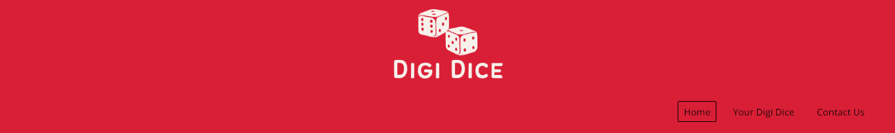

# Digi Dice

Visit the deployed site: [Digi Dice](https://begoodorbelucky.github.io/DigiDice/)

### Welcome to Digi Dice

### About Us
Welcome to Digi Dice. Our website offers a user-friendly and convenient platform for generating random dice rolls digitally. Whether you're engaged in online tabletop gaming, decision-making activities, or simply need a reliable random number generator, our website is designed to meet your needs. 

Featuring an intuitive user interface and compatibility across various web browsers and devices, Digi Dice offers users a simple and reliable platform for generating random dice rolls online. 

## Contents

- [Digi Dice](#Digi-Dice)
    - [Welcome to Digi Dice](#welcome-to-Digi-Dice)
    - [About Us](#about-us)
  - [Contents](#contents)
  - [User Experience (UX)](#user-experience-ux)
    - [Project Goals](#project-goals)
    - [Color Scheme](#color-scheme)
    - [Typography](#typography)
  - [Features](#features)
    - [General](#general)
    - [Landing Page](#landing-page)
    - [Dice Page](#dice-page)
    - [Contact Page](#contact-page)
  - [Technologies Used](#technologies-used)
    - [Languages Used](#languages-used)
    - [Websites and Programs Used](#websites-and-programs-used)
  - [Testing](#testing)
    - [Code Validation](#code-validation)
    - [Accessibility](#accessibility)
    - [Automated Testing](#automated-testing)
    - [Manual Testing](#manual-testing)
- [Finished Product](#finished-product)
- [Deployment](#deployment)
- [Credits](#credits)
    - [Content](#content)
    - [Media](#media)
- [Acknowledgements](#acknowledgements)
---

## User Experience (UX)

### Project Goals
- Successfully launch the "Digi Dice" website featuring a homepage, a 'dice' page with a functional rolling dice, and a contact page.
- Design an intuitive and visually appealing website interface that enhances user experience and encourages easy navigation.
- Ensure the website is fully responsive on all screen sizes, with a focus on mobile first design, providing a seamless and enjoyable experience on all devices.
- Create a user-friendly interface for rolling dice.
- This project targets gamers, tabletop RPG enthusiasts, and anyone who needs a virtual dice rolling tool.

### Color Scheme

The main colours used in the project are black (#000000) for the font, and Crimson (#D91F26) for the background colour. There are also elements of Blood Red (#690303), Tea Rose (#FACBCB) and Cosmic Latte (#FDF8E6) used throughout the project. This combination of warm reds, cool pinks, and stark black give the project attention grabbing contrast whilst remaing legible and visually appealing. 

### Typography

The main font used for the project is'Open Sans', with 'Courier New', Courier, and 'Monospace' used as a fallback should the 'Cinzel Decorative' not import correctly.

## Features

### General

- **Header**

  
    The header is a simple design featuring the logo of the website, and the navigation menu.

- **Navigation Menu**

  
The navigation menu has a responsive design that adapts to different screen sizes. When users are on a device with a screen size below 768px, the navigation menu appears as a     
'hamburger' icon. When clicked, the menu items appear, and the hamburger icon transforms, through the use the javascript, into an 'X' icon. When clicked, the users close the naviation menu and result to their current screen.

- **Footer**

  
  The footer has a simple and clean design, featuring a link to the site's email address. In future iterations, we may explore additional elements to enhance the footer, such as social media integration, additional contact information, or dynamic content updates.

### Landing Page

### Dice Page

### Contact Page

## Technologies Used

### Languages Used

- [HTML](https://www.w3schools.com/html/html_intro.asp)
- [CSS](https://www.w3schools.com/css/css_intro.asp)
- [Javascript](https://www.w3schools.com/js/js_intro.asp)

### Websites and Programs Used

- [Google Fonts](https://fonts.google.com/)

- [Font Awesome](https://fontawesome.com/)

- [Gitpod](https://www.gitpod.io/)

  - Gitpod was used as the integrated development environment for writing, committing, and pushing code to GitHub.

- [Github](https://github.com/)

  - Github was used to store the code, as well as facilitate version control.

- [Am I Responsive?](https://ui.dev/amiresponsive)

  - 'Am I Responsive' was used to visualize and test how the website appears on different screen sizes, including desktops, tablets, and mobile devices.

- [Chrome Developer Tools](https://developer.chrome.com/docs/devtools/)

  - Chrome DevTools was used to inspect, debug, and optimize the performance of the website.

- [W3C Markup Validator](https://validator.w3.org/)

  - W3C Markup Validator was used to validate the HTML code.

- [W3C CSS Validator](https://jigsaw.w3.org/css-validator/)
  - W3C CSS Validator was used to validate the CSS code.

## Testing

### Code Validation

- [W3C Markup Validator](https://validator.w3.org/) was used to ensure quality and compliance of the HTML code in this project.

- [W3C CSS Validator](https://jigsaw.w3.org/css-validator/) was used to ensure the quality and compliance of the CSS code in this project.

### Accessibility

- [Lighthouse](https://developer.chrome.com/docs/lighthouse/overview/)
  was used to ensure the accessibility of the project, to guarantee an inclusive and user-friendly experience for all visitors.

### Automated Testing

- [Chrome DevTools](https://developer.chrome.com/docs/devtools/)
  -Chrome DevTools was used to continuously monitor the project, ensuring the website's responsiveness and visual appeal on all device size.

- [Am I Responsive?](https://ui.dev/amiresponsive)
  -'Am I Responsive' was also used to ensure the website was fully responsive across a range of device sizes.

### Manual Testing

- Cross-Browser Compatibility:

  - Manual testing was conducted on different browsers (e.g., Chrome, Firefox, Safari) to ensure consistent performance.

- Device Compatibility:
  - The website has been tested on several different devices to successfully demonstrate there are no appearance, functionality or responsiveness issues. The devices tested include:
    - **Samsung Galaxy S22 Ultra**
    - **Toshiba Satellite L50-C**
    - **IPhone XE**
    - **iPad 10.2-inch (9th Generation)**
    - **Macbook Air 13.3-inch**

# Finished Product

| Page     | Desktop version                                                           | Mobile version                                                          |
| -------- | ------------------------------------------------------------------------- | ----------------------------------------------------------------------- |
| Index    |        |        |
| Dice     |          |  |
| Contact  |    |    |

# Deployment

- The code for this website was written on [Gitpod](https://www.gitpod.io/), which was then committed and pushed to [Github](https://github.com/).

# Credits

### Content

### Media
