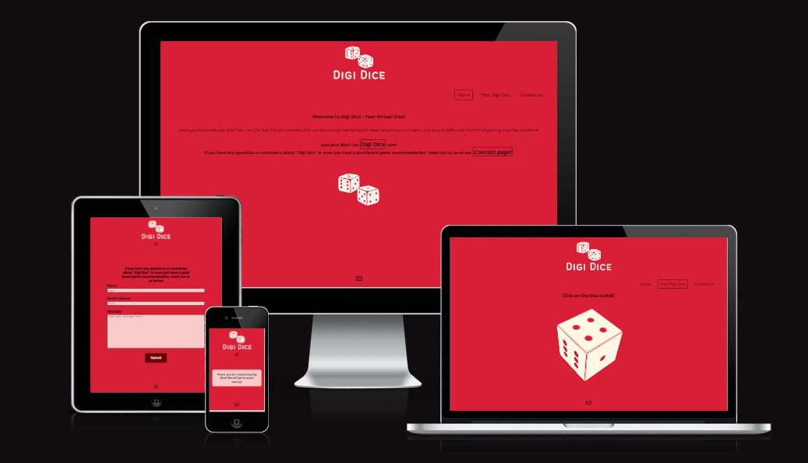

# Digi Dice

Visit the deployed site: [Digi Dice]()

### Welcome to Digi Dice

### About Us

## Contents

- [Digi Dice](#Digi-Dice)
    - [Welcome to Digi Dice](#welcome-to-Digi-Dice)
    - [About Us](#about-us)
  - [Contents](#contents)
  - [User Experience (UX)](#user-experience-ux)
    - [Project Goals](#project-goals)
    - [Color Scheme](#color-scheme)
    - [Typography](#typography)
  - [Features](#features)
    - [General](#general)
    - [Landing Page](#landing-page)
    - [Dice Page](#dice-page)
    - [Contact Page](#contact-page)
  - [Technologies Used](#technologies-used)
    - [Languages Used](#languages-used)
    - [Websites and Programs Used](#websites-and-programs-used)
  - [Testing](#testing)
    - [Code Validation](#code-validation)
    - [Accessibility](#accessibility)
    - [Automated Testing](#automated-testing)
    - [Manual Testing](#manual-testing)
- [Finished Product](#finished-product)
- [Deployment](#deployment)
- [Credits](#credits)
    - [Content](#content)
    - [Media](#media)
- [Acknowledgements](#acknowledgements)
---

## User Experience (UX)

### Project Goals

### Color Scheme

### Typography

## Features

### General

- **Header**

  

- **Navigation Menu**

  

- **Footer**

  

### Landing Page

### Dice Page

### Contact Page

## Technologies Used

### Languages Used

- [HTML](https://www.w3schools.com/html/html_intro.asp)
- [CSS](https://www.w3schools.com/css/css_intro.asp)
- [Javascript](https://www.w3schools.com/js/js_intro.asp)

### Websites and Programs Used

- [Google Fonts](https://fonts.google.com/)

- [Font Awesome](https://fontawesome.com/)

- [Gitpod](https://www.gitpod.io/)

  - Gitpod was used as the integrated development environment for writing, committing, and pushing code to GitHub.

- [Github](https://github.com/)

  - Github was used to store the code, as well as facilitate version control.

- [Am I Responsive?](https://ui.dev/amiresponsive)

  - 'Am I Responsive' was used to visualize and test how the website appears on different screen sizes, including desktops, tablets, and mobile devices.

- [Chrome Developer Tools](https://developer.chrome.com/docs/devtools/)

  - Chrome DevTools was used to inspect, debug, and optimize the performance of the website.

- [W3C Markup Validator](https://validator.w3.org/)

  - W3C Markup Validator was used to validate the HTML code.

- [W3C CSS Validator](https://jigsaw.w3.org/css-validator/)
  - W3C CSS Validator was used to validate the CSS code.

## Testing

### Code Validation

- [W3C Markup Validator](https://validator.w3.org/) was used to ensure quality and compliance of the HTML code in this project.

- [W3C CSS Validator](https://jigsaw.w3.org/css-validator/) was used to ensure the quality and compliance of the CSS code in this project.

### Accessibility

- [Lighthouse](https://developer.chrome.com/docs/lighthouse/overview/)
  was used to ensure the accessibility of the project, to guarantee an inclusive and user-friendly experience for all visitors.

### Automated Testing

- [Chrome DevTools](https://developer.chrome.com/docs/devtools/)
  -Chrome DevTools was used to continuously monitor the project, ensuring the website's responsiveness and visual appeal on all device size.

- [Am I Responsive?](https://ui.dev/amiresponsive)
  -'Am I Responsive' was also used to ensure the website was fully responsive across a range of device sizes.

### Manual Testing

- Cross-Browser Compatibility:

  - Manual testing was conducted on different browsers (e.g., Chrome, Firefox, Safari) to ensure consistent performance.

- Device Compatibility:
  - The website has been tested on several different devices to successfully demonstrate there are no appearance, functionality or responsiveness issues. The devices tested include:
    - **Samsung Galaxy S22 Ultra**
    - **Toshiba Satellite L50-C**
    - **IPhone XE**
    - **iPad 10.2-inch (9th Generation)**
    - **Macbook Air 13.3-inch**

# Finished Product

| Page     | Desktop version                                                           | Mobile version                                                          |
| -------- | ------------------------------------------------------------------------- | ----------------------------------------------------------------------- |
| Index    |        |        |
| Dice     |          |  |
| Contact  |    |    |

# Deployment

- The code for this website was written on [Gitpod](https://www.gitpod.io/), which was then committed and pushed to [Github](https://github.com/).

# Credits

### Content

### Media
